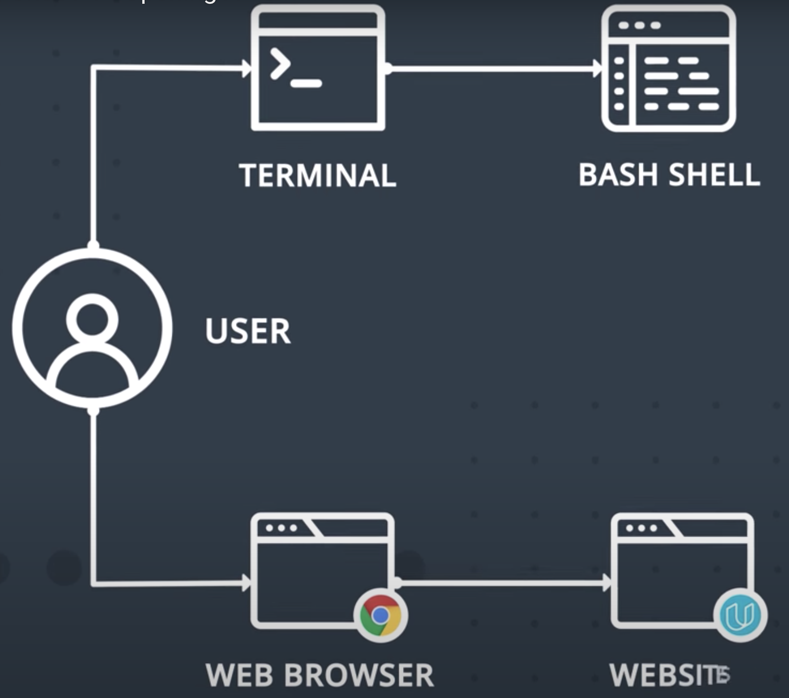
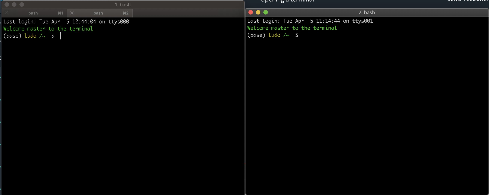
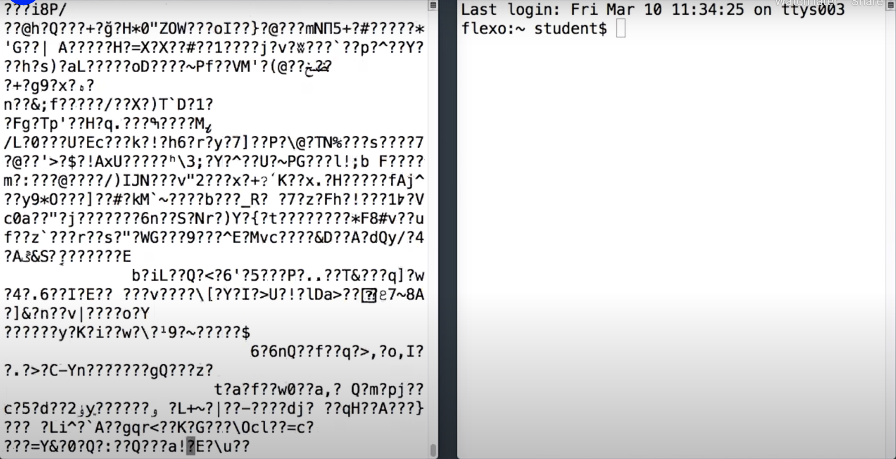

# Opening a Terminal

On the **Mac**, you'll find the **Terminal program** in the **Utilities** folder. On the **Unix** system the Terminal program is usually pretty easy to find, but can be in different places.

It doesn't matter which terminal program you end up using, the **Terminal** is just an **interface** to the **Shell** and to other command line programs that will be running inside it.

Kind of like how web browser is an interface to websites and services.

Now, pretty much every Terminal program has a bunch of settings that you can mess around with to change the fonts and colours, and so on.

Now, something to keep in mind, **you can have multiple terminals windows** open at once. In fact, you can have any number of terminals open at once.

Each of them has **its own interface of the shell**: **A separate process on your computer**.

So, if you happen to do something in one Terminal that freezes or breaks it, well, you can always just use another one.
