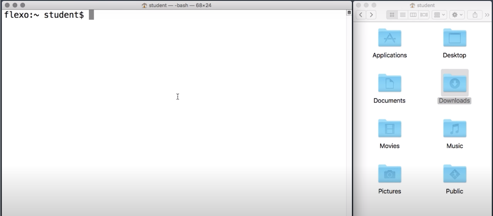
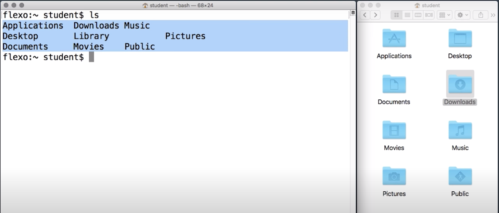
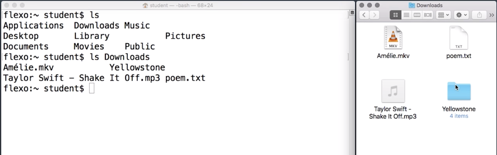
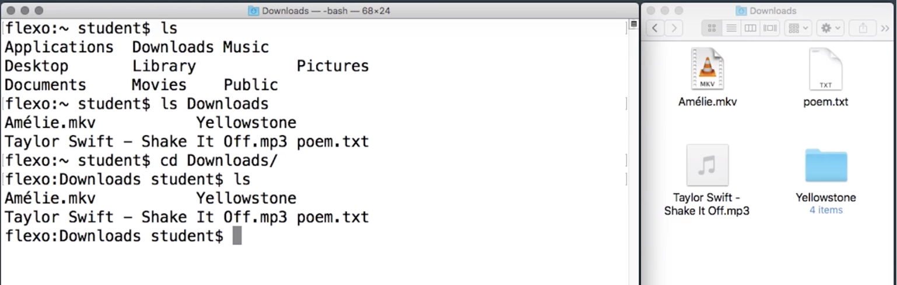

# Navigating Directories

Managing your directories and file structure in your computer or servers is an important skill you need to use in the development and deployment phases in your Web development.

In this concept, we are going to show you how to use the *Shell* with multiple commands to navigate and organize your files.

Practice the commands and remember to practice locally in your computer too.



When you look at your files through your graphical interface, such as Mac's finder, or the Windows File Explorer, a folder window shows you the files in subdirectories in a particular folder or directory.

Like, here's the `Downloads` directory in this computer for the `Downloads` folder.

Directories in a folder are basically the same thing. But in the *Shell*, we'll use the word *directory*.

## Listing directories



To list the contents of a directory in the shell, we can use the command `ls`. `ls` is a super shortened version of the word list

`ls = **LIST**`

When you start the *shell*, it usually starts out looking at your home directory. If you just run `ls` by itself, **it will print the contents of the current directory**.



To list another directory, say `Downloads`, you can type `ls` followed by the name of that directory.

`ls Downloads`

## Change Directory



You can also change what directory the *shell* is looking at, the command for this is `cd`, which stands for **change directory**.

`cd = Change Directory`

```console
(base) ludo /~  $  cd Downloads
(base) ludo /Downloads  $
```

After you `cd` into a particular directory, `ls` by itself will show the contents of that directory.

Many shell commands default interacting with the current directory.

### go back a directory

If you want to go back a directory, you can do that with the **special directory** named dot dot `..`, which is also called the parent directory.

```console
(base) ludo /~  $  cd Downloads
(base) ludo /Downloads  $  cd ..
(base) ludo /~  $
```

And the semicolon `;` let's you write **two commands on the same line**.

```console
(base) ludo /Downloads  $  cd .. ; ls
Applications         Library              Projects
Desktop              Movies               Public
Documents            Music                RStudio-1.3.1093.dmg
Downloads            OneDrive             bin
GitHub               Pictures
```

The *shell* will just return them in order.
