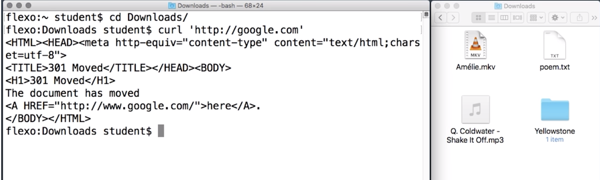

# Downloading (curl)

`curl` is used in command lines or scripts **to transfer data**.

## curl = Client URL



- `$ curl 'http://www.google.com'`

You can use `curl` to get any webpage but what it does is to show you the source code to the page which is kind of cool but not always directly useful. This is a lot like what you would see if you opened up the view source in the browser devtools.

Many times we’ll wish to **direct the response’s contents into a file**. This is done with the `-o` argument, like this:

- `$ curl -o google.html 'http://google.com'`

```console
ludo /Downloads  $  curl -o google.html 'http://www.google.com'
 % Total    % Received % Xferd  Average Speed   Time    Time     Time  Current
                                Dload  Upload   Total   Spent    Left  Speed
100 13985    0 13985    0     0  12497      0 --:--:--  0:00:01 --:--:-- 12497
(base) ludo /Downloads  $  ls google.html*
google.html
```

To get it to write to a file instead of displaying to the Terminal, we use the `-o` option, followed by the name that we'd like it to save under, like `google.html`. This is actually a really common pattern for Shell commands.

Let's break it down:

- Start with the name of the command: `curl`
- followed by some option: `-o google.html`
- followed by the object that we actually want to operate on, like the URL: `http://google.com`

We run this command `curl` will show a little progress message while it's downloading. It's pretty common for Unix programs to not displays any logs or done message if they run successfully. But it did run successfully, as we can see from the `ls` command that shows the file `ls google.html*`.

`-O`, `--remote-name`
  - Write output to a local file named like the remote file we get. (Only the file part of the  remote file is used, the path is cut off.)
  The remote file name to use for saving is extracted from the given URL, nothing else.
  Consequentially,  the  file  will  be saved in the current working directory. If you want the file saved in a different directory, make sure you change current working directory before  you  invoke curl with the -O, --remote-name flag!

**Note**

`-L`, `--location`
  - (HTTP/HTTPS) If the server reports that the requested page  has  moved  to  a  different  location
  (indicated  with  a Location: header and a 3XX response code), this option will make curl redo the request on the new place.

Usually **is better to use the** `-L` option.

- `$ curl -o google.html -L 'http://google.com'`

An equivalent command to get the source code saved in a file is:

`curl 'http://google.com' > google.html`

## Exercise

Enter a shell command to download `https://tinyurl.com/zeyq9vc` and save it as the file `dictionary.txt`. Remember to use the option to follow web redirects.

Run this command on your own computer, too! You'll need to download this file for the next exercise.

- `curl -o dictionary.txt -L 'https://tinyurl.com/zeyq9vc'`

```console
(base) ludo /Downloads  $  curl -o dictionary.txt -L 'https://tinyurl.com/zeyq9vc'
  % Total    % Received % Xferd  Average Speed   Time    Time     Time  Current
                                 Dload  Upload   Total   Spent    Left  Speed
100   654    0   654    0     0    193      0 --:--:--  0:00:03 --:--:--   193
100  916k  100  916k    0     0   140k      0  0:00:06  0:00:06 --:--:--  346k
(base) ludo /Downloads  $  ls dictionary.txt
dictionary.txt
```

By the way, a lot of URLs have special characters in them, such as the `&` sign, which have unusual meanings to the shell. That's why I'm always putting these URLs in quotes … even though these particular examples would work without them, it's a good practice to get into.
