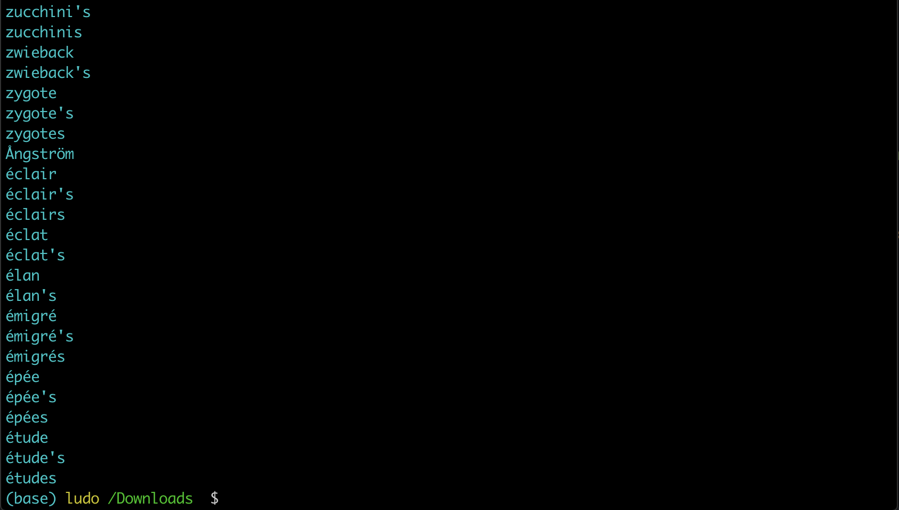
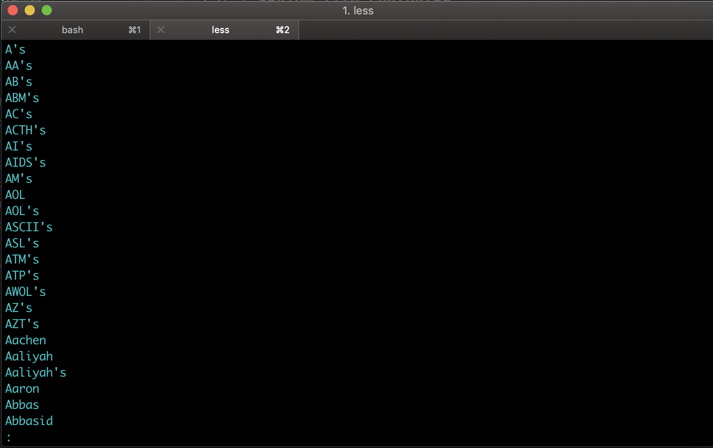
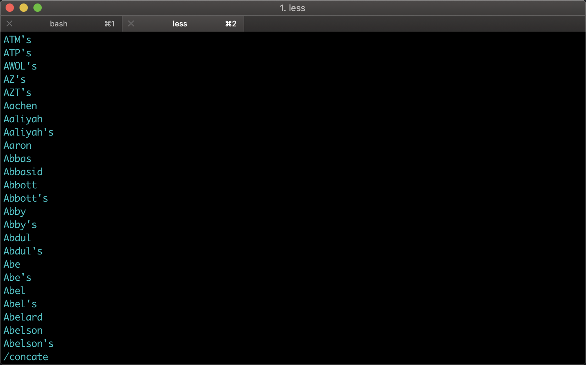
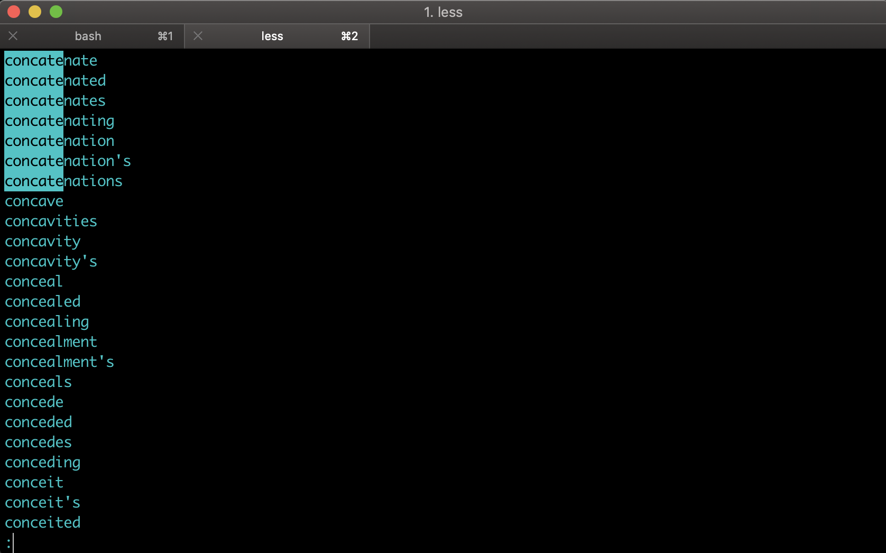

# Viewing Files (cat,less)

With the Shell, you can use **commands to view files**, let's learn how to do it in this concept.

## Commands
- `cat`: **View file content**.
- `less`: **View file content screen by screen**.

Remember from the previous concept you downloaded `dictionary.txt` file into `Downloads`, you will need to cd into Downloads directory.

There's a Shell command called `cat` that **just read the file and outputs the contents**. Actually, it can read any number of files. The name `cat` is short for `Concatenate`.

- `cat -> Concatentate`

Which means to run several things together. Let's try it out.

```console
(base) ludo /Downloads  $  cat dictionary.txt
```



That's not very useful, if we wanted to see the top of the file. I just blasted the file at our terminal so quick that it went right to the end.

Fortunately, there's another program, `less` which **shows us less of the file at once**. Specifically, it'll show one screenful of the file at a time.

- `$ less dictionary.txt`

```console
(base) ludo /Downloads  $  less dictionary.txt
```



You can press `space bar` to scroll down or you can use the arrow keys :arrow_up: or :arrow_down:. It has some other commands like `b` to go back or `/` to **search** a word.



Let's say we search for all the words that start with the string `concate`, so in the program we type `/concate`.



When you are done in `less`, you can press `q` to **quit** the program.

`less` is really handy. it's used internally by a lot of other programs that might sometimes need to display a lot of output and give you a chance to catch up.
Moreover, **less don’t require to load the whole file before viewing**. Try opening a large log file in Vim editor and less — you’ll see the speed difference.

1. Less Command – **Search Navigation**
Once you’ve opened a log file (or any file) using less file-name, use the following keys to search. Please note that the match will be highlighted automatically by default.

**Forward Search**
- `/` – search for a pattern which will take you to the next occurrence.
- `n` – for next match in forward
- `N` – for previous match in backward
**Backward Search**
- `?` – search for a pattern which will take you to the previous occurrence.
- `n` – for next match in backward direction
- `N` – for previous match in forward direction

Tip: If you dont bother about which direction the search is happening, and you want to search file path, or URL, such as `“/home/ramesh/”`, you can use backward search (?pattern) which will be handy as you don’t want to escape slashes each time.

Search Path
In forward: `/\/home\/ramesh\/`
In backward: `?/home/ramesh/`

2. Less Command – **Screen Navigation**
Use the following screen navigation commands while viewing large log files.

- `CTRL+F` – forward one window
- `CTRL+B` – backward one window
- `CTRL+D` – forward half window
- `CTRL+U` – backward half window

3. Less Command – **Line navigation**
In a smaller chunk of data, where you want to locate particular error, you may want to navigate line by line using these keys:

- `j` – navigate forward by one line
- `k` – navigate backward by one line

4. Less Command – **Other Navigations**
The following are other navigation operations that you can use inside the less pager.

- `G` – go to the end of file
- `g` – go to the start of file
- `q` or `ZZ` – exit the less pager

## Resources

- [less commands pager](https://www.thegeekstuff.com/2010/02/unix-less-command-10-tips-for-effective-navigation/)
