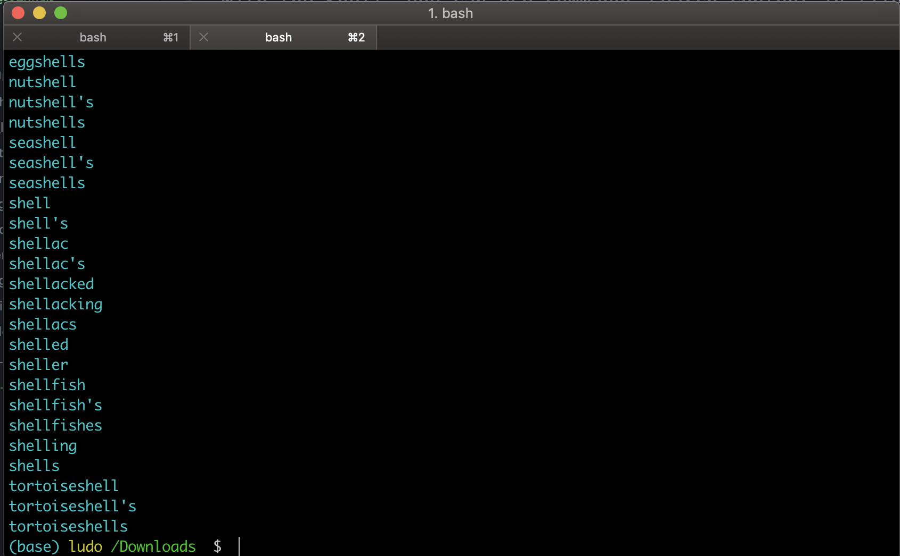
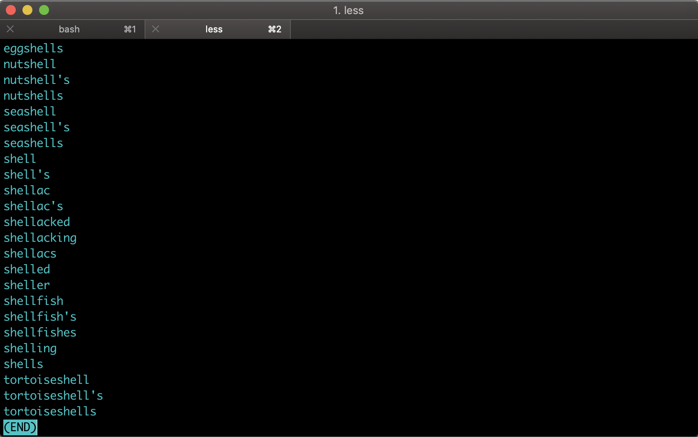
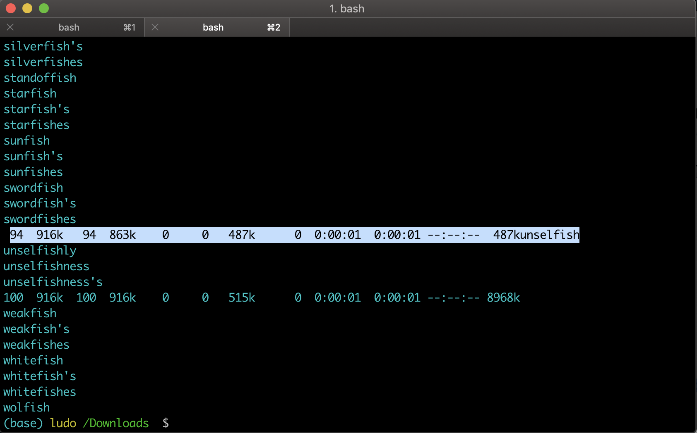
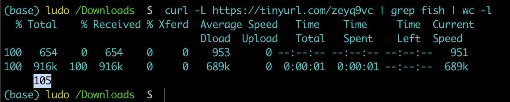

# Searching and pipes (grep,wc)

With the Shell, you can use commands search content in files.

## Commands
- `grep`: "global regular expression print,” processes text line by line and prints any lines which match a specified pattern
- `wc`: "short for word count" reads either standard input or a list of files and generates one or more of the following statistics: newline count, word count, and byte count.

Let's take the `dictionary.txt` file you've downloaded earlier and use it to see if a word is in the dictionary. There's a shell command called `grep` that knows **how to search a text file for lines with particular contents**.

- `$ grep shell dictionary.txt`

If you give a word, such as `shell`, and a file name, like `dictionary.txt`, it will read the file and output all the lines that contain that word.



But what if, as in this case, there are more lines than we can see at once.

- `grep shell dictionary.txt | less`



Well, one thing we can do is to ask the shell **to send the output of** `grep` **into the** `less` command. You can do this with the pipe or vertical bar character `|`.

So, What's going on here?

Well, the `grep` program reads the input file and prints out any lines that match the pattern, in this case any work containing the string `shell`. But the *Shell* has arranged things so that the output doesn't go directly to the Terminal. Instead, it gets sent into the `less` program, which displays those lines of the terminal one page at a time.

To read this command `grep shell dictionary.txt | less` out loud, you'd say *grep for shell in dictionary.txt and pipe it to less*.

Now, `grep` can also operate on input from another program.

```console
(base) ludo /Downloads  $  curl -L https://tinyurl.com/zeyq9vc | grep fish
  % Total    % Received % Xferd  Average Speed   Time    Time     Time  Current
                                 Dload  Upload   Total   Spent    Left  Speed
100   654    0   654    0     0    611      0 --:--:--  0:00:01 --:--:--   614
bluefish
bluefish's
...
```

`$ curl -L https://tinyurl.com/zeyq9vc | grep fish`

For instance, you can pull a file from the web using `curl` and immediately grep it for a particular pattern without having to save it to a file first. The output from the curl command `curl -L https://tinyurl.com/zeyq9vc` gets fed into the grep command `grep fish` as its input, instead of grep reading from a file.



As you can see, sometimes some of the output from `curl`, like the progress meter, gets mixed in with some of the output from grep so that can be a little bit confusing. They're actually not getting mixed to the Shell, but they're getting mixed on our terminal.

`$  curl -L https://tinyurl.com/zeyq9vc | grep fish > fish.txt`

```console
(base) ludo /Downloads  $  curl -L https://tinyurl.com/zeyq9vc | grep fish > fish.txt
  % Total    % Received % Xferd  Average Speed   Time    Time     Time  Current
                                 Dload  Upload   Total   Spent    Left  Speed
100   654    0   654    0     0    808      0 --:--:-- --:--:-- --:--:--   809
100  916k  100  916k    0     0   624k      0  0:00:01  0:00:01 --:--:-- 1898k
(base) ludo /Downloads  $  cat fish.txt
```

If we sent this to a file, it would be fine. It wouldn't get mixed in.



- `$  curl -L https://tinyurl.com/zeyq9vc | grep fish | wc -l`

Now, if you just wanted to know how many matches there are, like **how many words there are that contain the string fish**, there are a couple of different ways you can do that. One of them is to **pipe the output of** `grep` **into the** `wc` or word count program and **ask it to count lines with the** `-l` option. There we got `105`.

- `$  curl -L https://tinyurl.com/zeyq9vc | grep -c fish`

Another way is to give `grep` the option `-c` for count.


How many words are there in dictionary.txt that match the pattern ibo?

```console
(base) ludo /Downloads  $  grep -c ibo dictionary.txt
22
```
