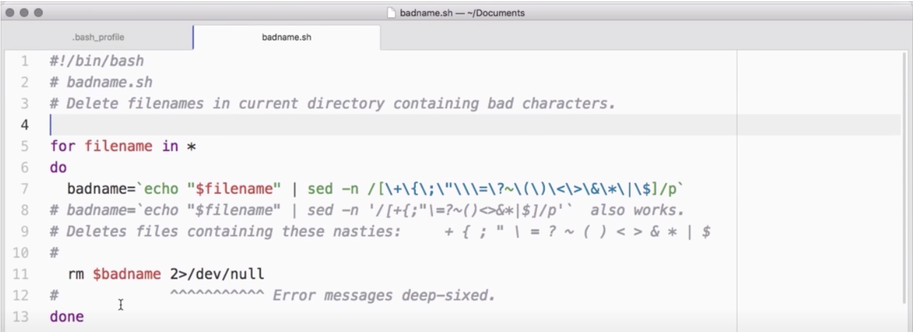

# Startup files (.bash_profile)

The Shell isn't just a user interface. **It's a programming language**.



Files containing shell commands are called **shell scripts**. These can be simple as one or two commands, just like you'd write at the Shell prompt. Or they can be long and complex program made of many functions. But we're not going to look very much into Shell programming. however, there's one place that's very useful to pretty much everyone who uses the Shell, and that's in **customizing the Shell itself**.

```console
flexo:~ student$ ls bin
magic
```

Here's an example, it's really common for Shell users to install programs into a **subdirectory of the home directory** caalled `/bin`, which stands for binary.

```console
flexo:~ student$ bin/magic
*
**
***
****
*****
******
*******
********
*********
***********
************
*************
**************
*** B O O M ***
```

But the Shell doesn't come preconfigured to know that there are any commands there. If you've a program installed in `bin/magic` and you want to run it from the Shell, **you'd have to type the directory out** as well as the command.

```console
flexo:~ student$ PATH=$PATH:/Users/student/bin
$ magic
*
**
***
****
*****
******
*******
********
*********
***********
************
*************
**************
*** B O O M ***
```

But that gets reset every time you start a new Shell window. In order to make that change sticky, you **have to put it into the** `Shell's configuration file`.

## Shell's configuration file

Now, for historical reasons, there are a few different files that the Bash Shell can run on start up to get its configuration.

On a Mac or on Windows system with `Git Bash`. The Shell in every terminal you open will run the commands in a file called `.bash_profile` (**Mac,Windows**).

But, on **Linux** system, `.bash_profile` is only run for some shell sessions specifically *log-in* Shell sessions. Non log-in shell run a file called `.bashrc` instead (**Linux**).

Now, this inconsistency can be a problem, if you want to use the same shell configuration on different operating systems. One popular way to get around this is to put a statement:

**.bashhrc**
```
PATH=$PATH:/Users/student/bin

if [-f ~/.bashrc ] ; then
   source ~/.bashrc
fi
```

But if you are on Mac or Windows, you can just use the `.bash_profile` without worrying about that.

**.bash_profile**
```
PATH=$PATH:/Users/student/bin
date
echo "Hello master!"
```

Any command you put in the configuration file **will be run every time you start the shell**. That includes variables assignments. It can also include anything you like to see, such as the date or a welcome message.

## Aditional Resources

For a deeper understanding, you can read this [post](https://friendly-101.readthedocs.io/en/latest/bashprofile.html)

## Instructor Notes
For users on Windows OS and using Git Bash you won't have a .bash_profile file. Don't worry I will explain to you how to create it.

1. If you're not in the home directory, change into it.

2. Create a file using touch .bashrc

3. Then edit it with Vim vim .bashrc

4. Save and close the file typing :wq and hit Enter.

5. Restart your Git Bash shell.

6. When you open your Git bash it will create a .bash_profile for you.
