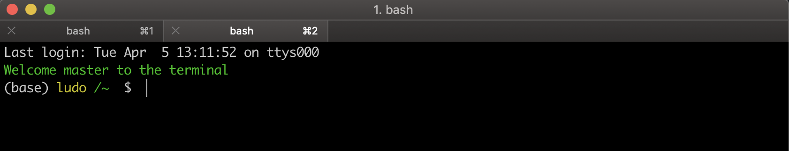
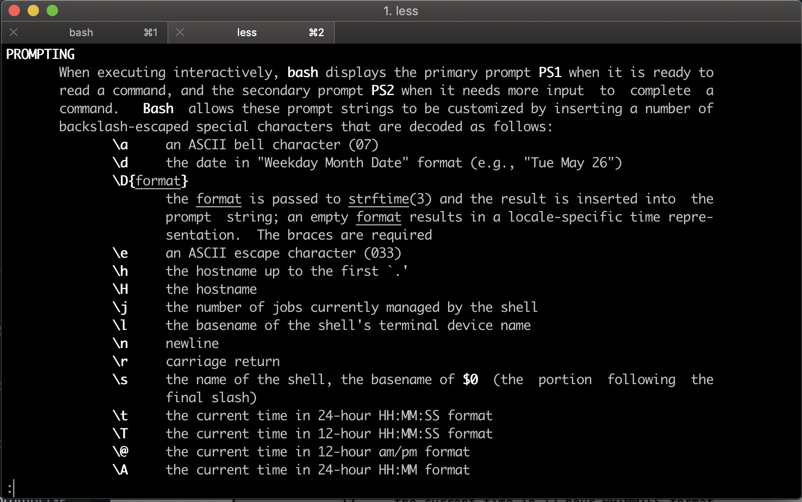

# Controlling the Shell prompt ($PS1)

When you start up a terminal session, what do you see? Usually, you see a Shell prompt.

But what it says will differ, from system to system

`flexo: ~ student$ `

Here, this one shows the name of the computer I'm using, which is `flexo`, the current working directory, which is `~` the home directory, and the name of the user I'm logged is as, which is `student`. My look like this:

But, there's a whole bunch of information that can put in the Shell prompt. Just run the command `$ man bash`

This here is from the **Bash manual**. In order to use any of these commands you put them in the `PS1` **shell variable**. And where would you do that? in the `.bash_profile`. You can use a good tool to customize your Shell prompt:

The tool is [http://bashrcgenerator.com](http://bashrcgenerator.com) by Julien Ricard. Try it out!
